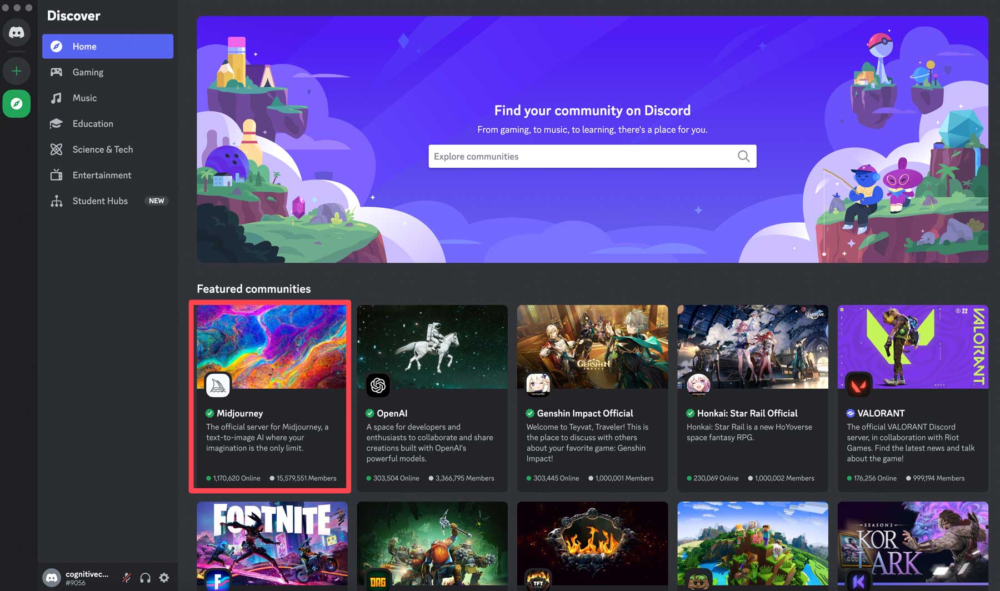
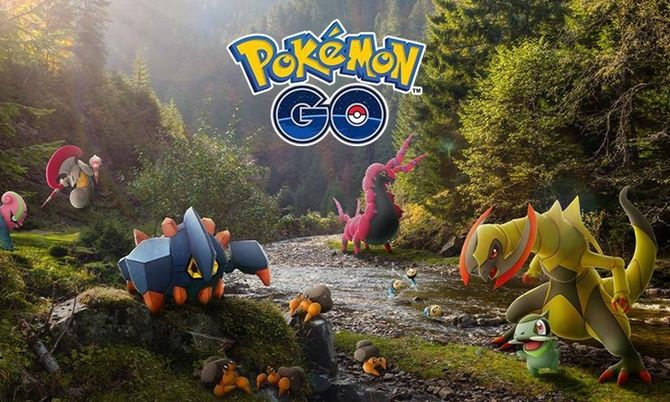

# **PEC3 – Manovich Reloaded**

**Nuevos casos de hibridación en la cultura del software contemporáneo**

**Autor:** Alberto Fco. Ambrona de la Lastra

**Asignatura:** Cultura Digital – Grado Multimedia (UOC)

**Curso: 2025/2026**

## Introducción

### La evolución de las especies mediáticas: hacia la "Remezcla Profunda"

En su obra seminal El lenguaje de los nuevos medios (2001), Lev Manovich comenzó a cartografiar la transformación de la cultura bajo la lógica del ordenador. Sin embargo, fue en El software toma el mando (2013) donde estableció la distinción crucial que estructura este ensayo: la diferencia entre multimedia e hibridación. Mientras que el multimedia de los años 90 funcionaba por yuxtaposición —colocando diferentes medios uno al lado del otro (texto, imagen, vídeo) sin que estos se afectaran mutuamente—, la hibridación representa una fusión mucho más radical.

En la hibridación, las propiedades, técnicas y estructuras de datos de un medio se transfieren a otro, creando "nuevas especies" mediáticas que no existían anteriormente. Manovich describió cómo Google Earth o el cine de animación 3D eran los primeros ejemplos de esta revolución invisible, donde la fotografía satelital adquiría la navegabilidad del videojuego. Sin embargo, en la última década, el software ha seguido evolucionando a un ritmo vertiginoso, impulsado por dos fuerzas tectónicas: la inteligencia artificial generativa y la computación ubicua.

Hoy ya no estamos solo ante la combinación de técnicas conocidas, sino ante una transcodificación masiva de la realidad física y la imaginación humana a datos numéricos. Este ensayo se propone actualizar la visión de Manovich analizando dos casos de estudio recientes —Midjourney y Pokémon GO— que demuestran que la "remezcla profunda" (deep remixability) ha salido de los estudios profesionales para instalarse en nuestros dispositivos cotidianos, reconfigurando tanto nuestra creatividad visual como nuestra relación con el espacio urbano.

## Caso 1 – Midjourney

### La imagen como metamedio algorítmico

Midjourney no debe entenderse simplemente como una herramienta de "dibujo asistido", sino como un nuevo metamedio que surge de la hibridación inédita entre el Procesamiento de Lenguaje Natural (NLP) y la Matriz de Píxeles. Representa un cambio de paradigma radical respecto a las herramientas de la "primera ola" del software creativo, como Photoshop. En Photoshop, el software simulaba herramientas físicas (el pincel, el aerógrafo, el cuarto oscuro) y el usuario manipulaba píxeles manualmente. En Midjourney, el usuario manipula significados semánticos.

### Análisis de la Hibridación: Automatización de Alto Nivel

Desde la perspectiva de Manovich, Midjourney realiza una automatización de alto nivel de la creación cultural. El software no ha aprendido a "simular trazos", sino que ha transcodificado la historia del arte completa en un espacio latente de vectores matemáticos. Al hibridar la estructura lógica del lenguaje con la información visual, el software permite operaciones que antes eran imposibles.

Esta hibridación provoca una ruptura en la linealidad de la producción mediática. En el software clásico, el creador debía conocer la técnica (cómo iluminar, cómo sombrear). En el software generativo, la técnica se ha convertido en una variable del algoritmo. Esto permite la "Deep Remixability" (Remezcla profunda): el usuario puede solicitar una imagen que mezcle "la textura del óleo del siglo XIX" con "la iluminación de neón de una película de ciencia ficción" y "la estructura de un plano arquitectónico". El software no pega estas cosas una encima de otra (como en un collage multimedia); las sintetiza píxel a píxel, hibridando técnicas visuales que físicamente serían incompatibles en un solo archivo coherente.

### Variabilidad Infinita y la Muerte del Objeto Único

Este proceso ilustra el principio de variabilidad de Manovich llevado a su extremo lógico. La imagen ya no es un objeto fijo, único y acabado. Cada prompt es una semilla que puede generar variaciones infinitas de un mismo concepto. La obra de arte se convierte en una instancia temporal de una base de datos latente.

Esto reconfigura el rol del "autor", que pasa de ser un artesano manual a un curador de bases de datos. La creatividad se desplaza de la ejecución a la selección y la iteración. Midjourney demuestra que el software ha dejado de ser una herramienta pasiva para convertirse en un colaborador activo que "alucina" cultura visual a partir de los datos que le hemos suministrado colectivamente.

!

## Caso 2 – Pokémon GO

### El espacio urbano como interfaz híbrida

Si Midjourney hibrida la imagen con el lenguaje, Pokémon GO hibrida el territorio físico con la base de datos. Lanzado por Niantic, este software ejemplifica a la perfección y lleva a la práctica masiva el concepto de "Espacio Aumentado" que Manovich anticipó en sus ensayos de mediados de los 2000: la superposición de una capa dinámica de datos sobre el espacio físico.

### Análisis de la Hibridación: El Montaje Espacial

En este caso, la hibridación técnica se produce entre tres medios que antes estaban separados: la cartografía digital (sistemas GPS y mapas vectoriales como OpenStreetMap), la cámara de vídeo en tiempo real (Realidad Aumentada) y la lógica del videojuego (mecánicas de caza, recolección y combate).

Lo que distingue a Pokémon GO de un simple "juego con mapa" es la transcodificación del espacio urbano. El software reescribe el significado de la ciudad física: una estatua real se convierte en una "Poképarada" (fuente de recursos), y un parque público se transforma en un "Gimnasio" (arena de combate). Se produce lo que Manovich llama un montaje espacial: la pantalla del móvil actúa como una membrana permeable donde coexisten el flujo de vídeo en directo de la realidad y los objetos sintéticos 3D generados por el software. No es una sustitución de la realidad (como en la Realidad Virtual), sino una hibridación donde el código informático se ancla a coordenadas geográficas específicas.

### Gobernanza del Software y Navegación Programada

Lo más revolucionario de este caso es cómo el software "toma el mando" de la movilidad física. A diferencia de los medios tradicionales que se consumen de forma estática (cine, TV, ordenador de escritorio), este medio híbrido exige el desplazamiento corporal. El algoritmo dicta por dónde caminan los usuarios, creando flujos de movimiento humanos basados en bases de datos virtuales.

Aquí vemos la culminación de la base de datos como forma cultural: la ciudad se navega no por su topografía física, sino por su densidad de datos. El software organiza eventos sociales masivos (Días de la Comunidad) y modifica el comportamiento económico y social de los barrios. Pokémon GO demuestra que la hibridación contemporánea no solo ocurre dentro de la pantalla, sino que utiliza la pantalla para reprogramar el uso del espacio público.

## Conclusión

### Hibridaciones para un software que sigue tomando el mando

El análisis comparado de Midjourney y Pokémon GO confirma la vigencia y la necesidad de actualizar la tesis central de Manovich: el software no es una capa neutra, sino el motor invisible que propulsa y da forma a la cultura contemporánea. Sin embargo, estos casos añaden una nueva dimensión a su teoría que podría formar parte de ese hipotético "Volumen 2" de El software toma el mando.

Hemos observado que la hibridación ha evolucionado. Ya no se trata solo de una hibridación estética para crear nuevos efectos visuales (como en el cine de los 2000), sino de una hibridación generativa y espacial.

Generativa: Porque el software (Midjourney) ya no solo gestiona medios, sino que genera cultura visual de forma autónoma, hibridando toda la historia del arte en un prompt.

Espacial: Porque el software (Pokémon GO) ha salido del ordenador para reprogramar la ciudad, hibridando el código con el asfalto.

Vivimos, por tanto, en un estado de hibridación permanente y ubicua. Las fronteras entre el dato y el mundo físico, o entre el lenguaje y la imagen, se han disuelto gracias a la universalidad del código binario. Entender estos mecanismos —mirar el mundo con las "gafas de Manovich"— es indispensable para comprender no solo cómo consumimos medios, sino cómo habitamos nuestra realidad.

Si el software ha aprendido a generar imágenes sin dibujar y a convertir la ciudad en una interfaz navegable, la pregunta que queda abierta es qué otras dimensiones de la experiencia humana están ya siendo transcodificadas sin que seamos plenamente conscientes. Quizá el verdadero legado de Manovich no sea haber descrito los nuevos medios, sino habernos enseñado a detectar el momento exacto en que el software deja de imitar la realidad para empezar a reprogramarla.

## **Uso de IA**

En el desarrollo de esta PEC se ha hecho un uso limitado de herramientas de inteligencia artificial como apoyo en la exploración de enfoques teóricos, revisión sintáctica y estructuración de los argumentos, siguiendo las recomendaciones de la UOC sobre el uso responsable de IA en contextos académicos. La selección de los casos, el análisis conceptual, la argumentación teórica y la redacción final corresponden al autor.

## **Referencias**

Manovich, L. (2005). El lenguaje de los nuevos medios de comunicación. Paidós.

Manovich, L. (2007). Comprender los medios híbridos. (Traducción de la Cátedra de Análisis y Crítica).

Manovich, L. (2013). El software toma el mando. Editorial UOC.

## **Referencias de Software:**

Midjourney Inc. (2022). Midjourney [Software de IA Generativa]. Recuperado de https://www.midjourney.com

Niantic Labs. (2016). Pokémon GO [Videojuego de Realidad Aumentada]. Recuperado de https://pokemongolive.com

## Licencia

Este trabajo se publica bajo una licencia de Creative Commons Reconocimiento-NoComercial-CompartirIgual 4.0 Internacional (CC BY-NC-SA 4.0).
Permite copiar, redistribuir y transformar el material para fines no comerciales, siempre que se cite la autoría original y se distribuya bajo la misma licencia.